# Module 5: Ansible

## Topics Covered:

[Ansible](#Ansible)

[Server Installation](#Server-Installation)

[Environment setup](#Environment-setup)

[Create an inventory file](#Create-an-inventory-file)

[Test device connectivity](#Test-device-connectivity)

[Ansible Documentation](#Ansible-Documentation)

[Ansible Playbooks](#Ansible-Playbooks)

[Build an IOS XE CLIs Playbook](#Build-an-IOS-XE-CLIs-Playbook)

[Build a Playbook for IOS XE commands](#Build-a-Playbook-for-IOS-XE-commands)

[Using NETCONF in Ansible](#Using-NETCONF-in-Ansible)

[Conclusion](#Conclusion)


## Ansible

Ansible is an open source configuration management platform.

Configuration Management is the practice of automating software provisioning, configuration management, and application deployment. 

This practice has been widely used across IT systems management by many organizations large and small for over a decade. Having been proven successful with servers and applications, in recent years, it has extended to the network as well.

With these tools you can define and enforce configuration related to system level operations (e.g., authentication, logging, image), interface level configuration (e.g., VLAN, QoS, Security), routing configurations (e.g., OSPF or BGP), and much more.

Ansible is based on an "agent-less" architecture, so there is no need to install anything onto the Cisco IOS XE device to get started. 

Ansible Core modules for Cisco IOS and IOS XE devices have been available since release 2.3 so there is no need for anything outside of a base Ansible installation.

Both CLI-based and NETCONF-based configuration are supported. The Ansible NETCONF implementation changed in the 2.5 release, leveraging the newly introduced NETCONF connection instead of the usual local connection.

In this lab we are going to use Ansible 2.9.6 release.


The picture below describes the main Ansible terminology:

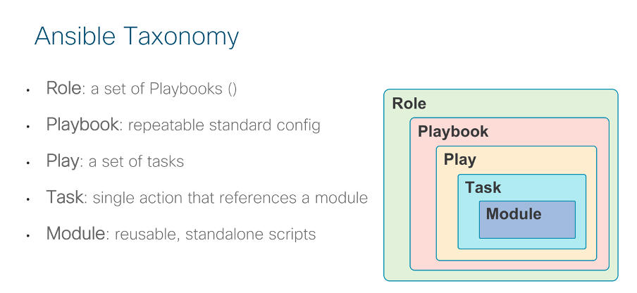

Ansible provides off-the-shelf modules to manage a variety of servers, application and network devices. In this lab we are going to mainly use the Ansible IOS modules.

## Server Installation

Ansible can be installed on any computer running the most popular Linux distributions like Red Hat, CentOS, Fedora, Debian, or Ubuntu, using either the OS package manager or via the Python package manager (pip).

For instance, you can install latest Ansible on an Ubuntu server with the following command. In this lab Ansible has been already pre-installed in the Ubuntu Server. You don't need to execute  the following command its just for reference.

```
# sudo pip3 install ansible
```

All the Cisco IOS XE modules are included in Ansible Core so no additional effort is required to begin automating your Cisco IOS XE devices.

Step 1. Open the Ubuntu server PuTTY session by clicking on **Ubuntu** on the desktop. You can verify if Ansible is installed in our lab and related version with:

Note: If you are using an existing PuTTY window, be sure to return to the home directory by typing **cd** into the Ubuntu server.

```
auto@programmability:~/ ansible --version
```

You should see the following:

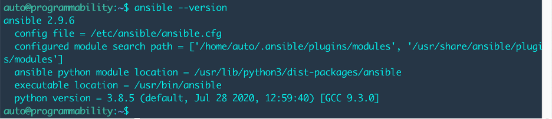

## Environment setup

Create an Ansible configuration file

The Ansible configuration file stores the default configs used by all Playbooks.

Step 2. On the Windows host, open **Sublime Text 3** from the Start menu, create a new file and enter the following into the window:


```
[defaults]
inventory = ./hosts
host_key_checking = False
roles_path = ./
remote_user = admin
deprecation_warnings=False
```


Save the file as **ansible.cfg** in CL_Ansible dir as following:

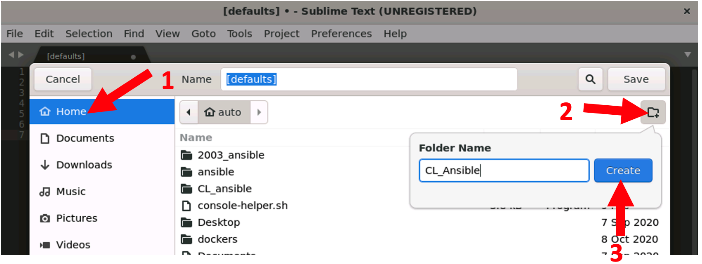


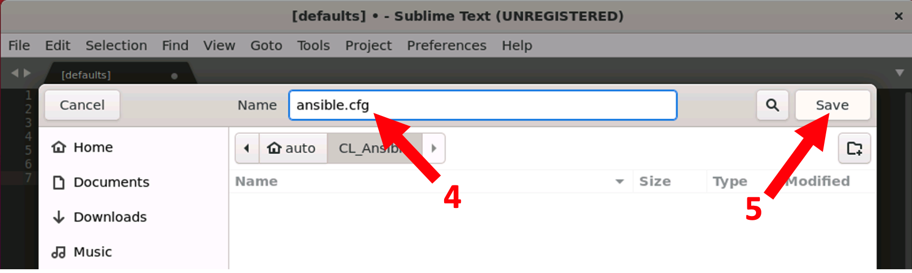


These ensure that Ansible:

- Uses the inventory **hosts** file in the local directory
- Disables host checking to automatically add hosts to **known_hosts** file
- Sets the roles path to the local directory
- Set the default user for device connections to **admin**
- Turn off any **deprecation warnings**

## Create an inventory file

The inventory file is where the devices under management are listed. Devices can be grouped, and a single device can be included in multiple groups.

Step 3. On the Windows host, open **Sublime Text 3** from the Start menu, create a new file and enter the following into the window:

```
[csr1000v]
10.1.1.2
 
[c9300]
10.1.1.5
 
[c9800]
10.1.1.6
 
[ios:children]
#csr1000v
c9300
#c9800
 
[ios:vars]
ansible_connection=network_cli
ansible_network_os=ios
 
[ubuntu]
10.1.1.3
```

Save the file as **hosts**

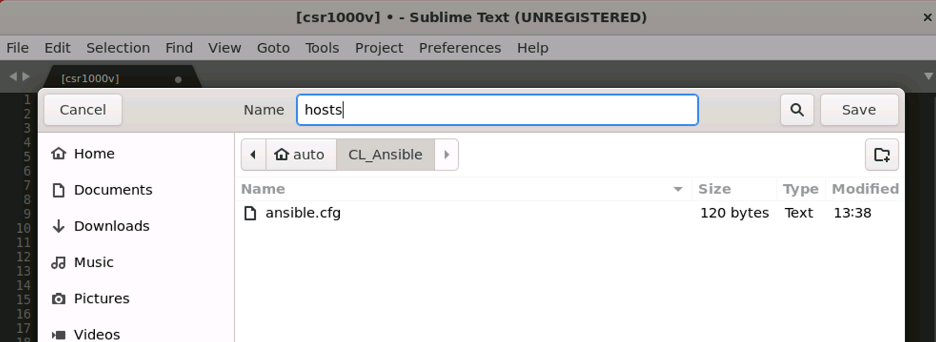


In the above hosts file, we have three groups called **csr100v**, **c9300** and **c9800**, with one device each. Groups can be nested like the **ios-xe** group which includes all three groups.

The default device connection is set to **network_cli** (that is CLIs over SSH), and Operating System type to ios for all the device in the **ios-xe** group, that is, for all the devices in this lab.

Defaults can be overridden in playbooks and at the command line.

We’ll see some override examples later in the lab.

Note: In this lab we are going to use only c9300.

## Test device connectivity

To make sure the Ansible server can reach all the devices, go to the Ubuntu server, move to the ansible directory:

```
auto@programmability:~/ cd ~/CL_Ansible/
```

and use the following Ansible command and provide the device SSH password admin

```
auto@programmability:~/CL_Ansible$ ansible ios -m ping -u admin -k
SSH password: Cisco123
```

Where:

- **ios-xe** is the device group
- **ping** is the Ansible module to test device connectivity
- **-u** is the option to provide the device SSH username
- **-k** is the option to provide the device password at run time

 

You should see the following:

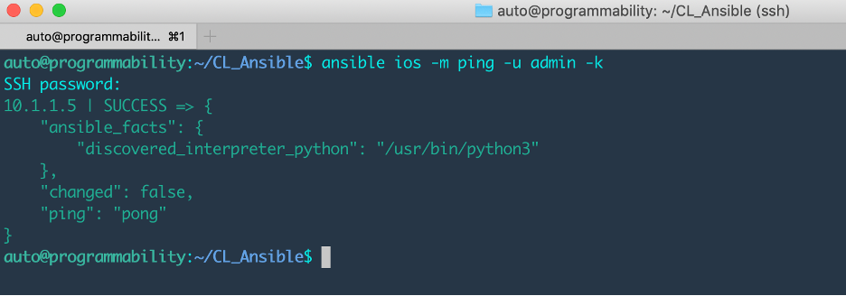


## Ansible Documentation

Thorough documentation for all Cisco IOS XE modules can be found on the Ansible website (http://docs.ansible.com/ansible/latest/modules/ios_vrf_module.html) or alternatively from the terminal, by utilizing the inbuilt documentation tool.

 Step 1.     Test the documentation tool with the **ios_config** module:

```
auto@programmability:~/CL_Ansible$ ansible-doc ios_config
```

You should see the following:

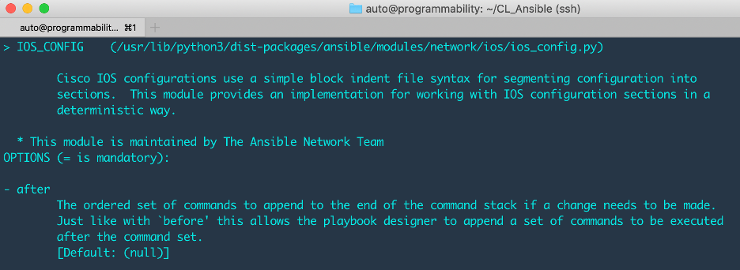

The documentation tool provides a description of the given module, all the mandatory and optional parameters, as well as some useful examples to start playing with the module.

 Exit out of the documentation screen when finished by pressing "q".

## Ansible Playbooks

An Ansible Playbook is a repeatable standard config. Playbooks are written in YAML, a common encoding format, which is very easy to read and uses indentation for creating the script hierarchy. Pay extra attention to the indentation!!!

In the next steps, you will build and execute several Ansible Playbooks

 

 Step 1.     Write a Playbook to configure VRFs

In this initial playbook we will provision a number of VRFs across all devices and remove (**purge**) any other VRF configured on the device. We will use the Ansible module called **ios_vrf** to automate this task.

 

On the Windows host, open **Sublime Text 3** from the Start menu, create a new file and enter the following into the window:

```
---

- name: configure vrfs and remove any other vrf configured
  hosts: ios
  gather_facts: no

  tasks:
    - name: configure vfrs and purge all others
      ios_vrf:
        vrfs:
            - red
            - blue
            - yellow
        purge: yes
```

**Note:** Please note carefully that the file begins with three hyphens! (---)

Save the file as **vrf.yaml**

Sublime will autodetect the YAML format and display the file like in the picture below:

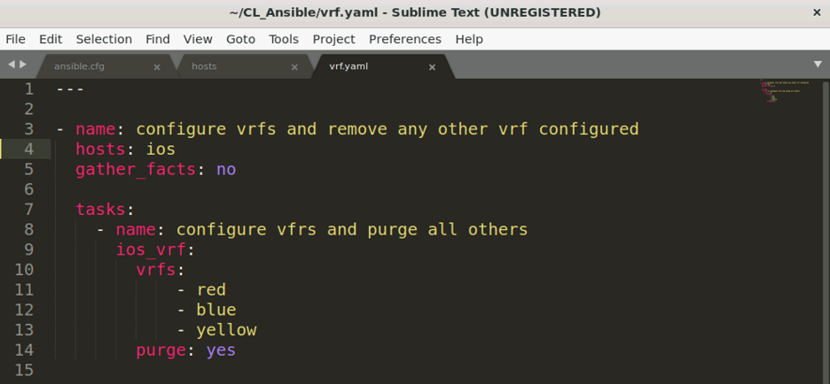

If the colors do not match those shown in the screen shot, most likely something is wrong with the file indentation. Double check before proceeding to the next step.

 

 Step 3.     Let’s analyze the playbook top to bottom:

- All the YAML files start with the triple dash characters.
- **name**: name is assigned to the playbook “configure vrfs…”
- **hosts**: define the group of devices, remember **ios-xe** group include both the cat3k and cat9k. By default, the Playbook executes against all the devices in the given group
- **gather_facts**: facts (HW and SW info) can be collected from the managed device. In this playbook it is disabled to speed up the playbook execution but you can turn it on replacing **no** with **yes**
- **tasks**: there is a single task in this example and it’s named “configure vfrs and purge all others”
- **ios_vrf**: is the Ansible module provided to manage VRFs on a Cisco device running IOS
- **vrfs**: is the **ios_vrf** module option to provide the list of VRFs to be configured, in this case the VRFs are **red**, **blue** and **yellow**
- **purge:** is the optional **ios_vrf** module parameter. If set to **yes**, all VRFs other than the one listed above are removed from the device

By default, Ansible will use the inventory hosts file located in **/etc/ansible/hosts**. However, a different hosts file can be specified using the **-i** flag at runtime or defined in the **ansible.cfg** file. We set the inventory to the local **./hosts** file in the ansible.cfg file in previously.

 

 Step 1.     Now run the playbook in the Ubuntu Server with the following command and provide the password **Cisco123**:

```
auto@programmability:~/CL_Ansible$ ansible-playbook vrf.yaml -u admin -k
SSH password:  Cisco123
```

You should see the following:

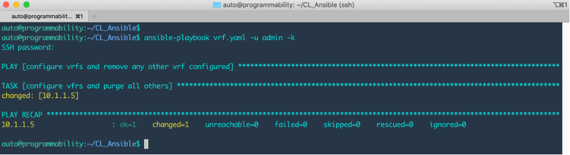

Let’s quickly analyze the output:

- both the playbook and task name (PLAY and TASK) are shown during the playbook execution
- the execution was successful (OK=1) for all the devices
- the configuration of both devices has been changed (changed=1)

 

 Step 1.     Now connect to one of the devices using the links in the Windows desktop (c9300) and verify that the VRFs have been configured.

You should see the following:

```
c9300# sh run | include vrf def
vrf definition Mgmt-vrf
vrf definition blue
vrf definition red
vrf definition yellow
```

Ansible provides many more modules to configure other IOS XE features like VLANs, users, static routes, L2 and L3 interfaces and so on.

## Build an IOS XE CLIs Playbook

For IOS XE features not yet supported by Ansible or for configurations based on a known list of configuration CLIs, Ansible provides a module named **ios_config**.

 

 Step 1.     On the Windows host, open **Sublime Text 3** from the Start menu, create a new file and enter the following into the window:

```
---

- name: configure a set of IOS XE CLIs using the Ansible ios_config module 
  hosts: ios
  gather_facts: no

  tasks:

    - name: Configure ntp server
      ios_config:
        lines:
          - ntp server 171.68.38.65
          - ntp server 1.2.3.4

    - name: Configure acl
      ios_config:
        lines:
            - 10 permit ip host 1.1.1.1 any log
            - 20 permit ip host 2.2.2.2 any log
            - 30 permit ip host 3.3.3.3 any log
            - 40 permit ip host 4.4.4.4 any log
            - 50 permit ip host 5.5.5.5 any log
        parents: ip access-list extended AnsibleTest
        before: no ip access-list extended AnsibleTest
        match: exact
```

Save the file as **config.yaml**

You should see the following:

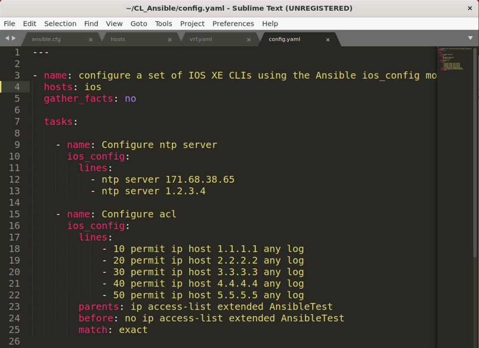

The first task configures a given list of NTP servers and the second task an extended ACL.

Notice the single ACL entries are applied after having removed the ACL with the option **before** and entered in the ACL config mode using the option **parents**.

 

 Step 1.     Return to the Ubuntu server and execute the playbook:

```
auto@programmability:~/CL_Ansible$ ansible-playbook config.yaml -u admin -k
SSH password: Cisco123
```

Connect to one of the devices using the link in the Windows desktop and verify both the NTP and ACL configurations have been applied.

You should see the following output:

```
c9300# sh run | i ntp
ntp server 171.68.38.65
ntp server 10.1.1.3
ntp server 1.2.3.4
c9300#

c9300# sh run | sec ip acc
ip access-list extended AnsibleTest
 permit ip host 1.1.1.1 any log
 permit ip host 2.2.2.2 any log
 permit ip host 3.3.3.3 any log
 permit ip host 4.4.4.4 any log
 permit ip host 5.5.5.5 any log
```

## Build a Playbook for IOS XE commands

In the previous step we used the module for IOS XE configuration CLIs.

 What about IOS XE exec CLIs? You need to use the **ios_command** module instead.

 Step 1.     On the Windows host, open **Sublime Text 3** from the Start menu, create a new file and enter the following into the window:

```
---

- name: run commands on Cisco IOS XE devices
  hosts: ios
  gather_facts: no

  tasks:
    - name: show module and ip interfaces brief
      ios_command:
        commands:
            - show module
            - show ip interface brief
```

Save the file as **commands.yaml**

You should see the following:

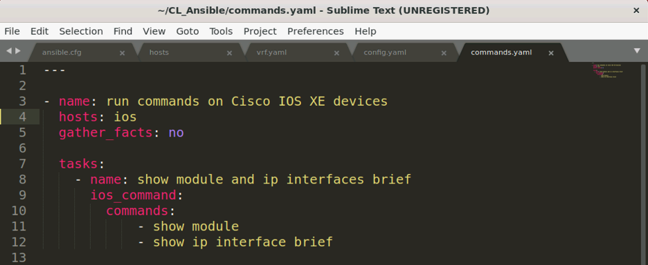

In the Playbook above we have only one task to execute two IOS XE exec commands.

 Step 1.     Now run the playbook in the Ubuntu Server with the following command and provide the password **Cisco123**:

```
auto@programmability:~/CL_Ansible$ ansible-playbook commands.yaml -u admin -k
SSH password:  Cisco123
```

You should see the following:

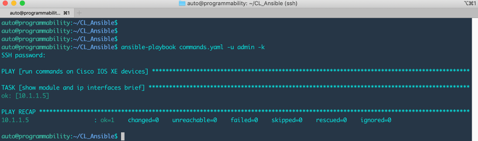

The Playbook was executed successfully (OK=1) but…where is the CLI output???

 Step 1.     Try again but this time add a **-v** option at the end.

```
auto@programmability:~/CL_Ansible$ ansible-playbook commands.yaml -u admin -k -v
```

 You should see the CLIs output like in the figure below.

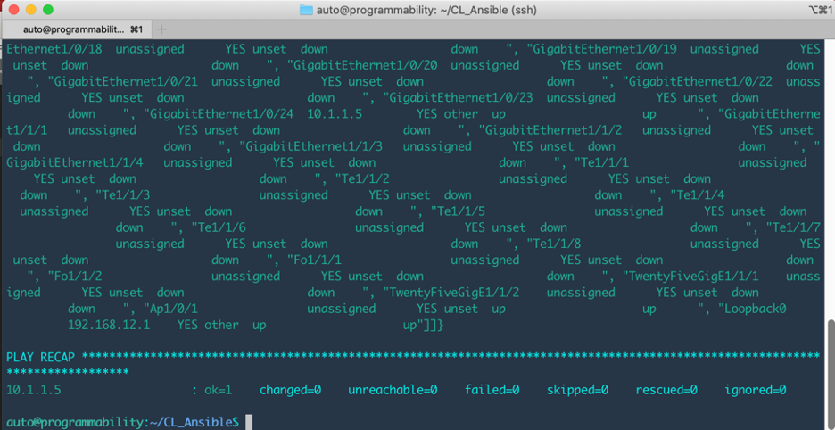

If you check the output carefully, you’ll see that the output is stored in two variables named **stdout** and **stdout_lines**. The first variable stores the output in a single string and the single CLI output lines are separated by \n, that is, Carriage Return (Enter) characters while the second variable is a list of strings, each storing a single CLI output line.

The **-v** option we added in the second playbook execution is the Ansible option to provide a more verbose output, very useful to debug Playbooks executions and failures. The more v's you provide, the more verbosity you get. For example adding **-vv** will provide more verbose output than **-v**.

 

## Using NETCONF in Ansible

NETCONF connection is also available in Ansible. Using “netconf-config” module in ansible allows the user to send a configuration XML file to a networking device and detects if there was a configuration change.

Step 1. To configure an interface description using NETCONF, on the Windows host, open **Sublime Text** from the Start menu, create a new file and enter the following into the window:

```
---

- name: test Ansible connection netconf on Cisco IOS XE
  hosts: c9300
  vars:
      ansible_connection: netconf
      ansible_network_os: default
  gather_facts: no

  tasks:
  - name: set Management interface description
    netconf_config:
      xml: |
        <config xmlns="urn:ietf:params:xml:ns:netconf:base:1.0">
          <interfaces xmlns="urn:ietf:params:xml:ns:yang:ietf-interfaces">
            <interface>
              <name>GigabitEthernet1/0/1</name>
              <description>Managed by Ansible using netconf connection</description>
            </interface>
          </interfaces>
        </config> 
```

Save the file as **netconf-description.yaml**

You should see the following:

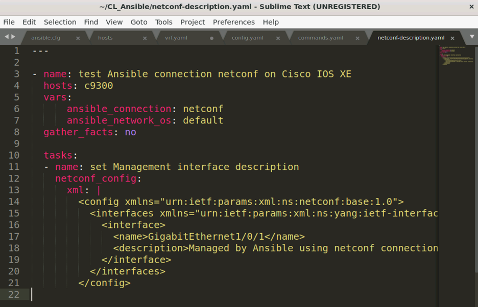

- In     this playbook we are using “**vars**”     to define ansible_connection and ansible_network_os to use locally instead     of changing in the ansible.cfg.
- **netconf_config** is the module in     ansible to configure on the network device using NETCONF connection

Step 2. Now run the playbook in the Ubuntu Server with the following command and provide the password **Cisco123**:

```
auto@programmability:~/CL_Ansible$ ansible-playbook netconf-description.yaml -u admin -k
SSH password:  Cisco123

```

Connect to c9300 in the Windows desktop and verify interface description on gi1/0/1 have been applied.

You should see the following output:

```
C9300#sh run int gi 1/0/1
Building configuration...

Current configuration : 95 bytes
!
interface GigabitEthernet1/0/1
 description Managed by Ansible using netconf connection
end
```

Step 3. To configure telemetry subscriptions using NETCONF, on the Windows host, open **Sublime Text** from the Start menu, create a new file and enter the following into the window:

```
---

- name: test Ansible connection netconf on Cisco IOS XE
  hosts: c9300
  vars:
      ansible_connection: netconf
      ansible_network_os: default
  gather_facts: no

  tasks:
  - name: establish subscription
    netconf_config:
      xml: |
          <config xmlns="urn:ietf:params:xml:ns:netconf:base:1.0">
            <mdt-config-data xmlns="http://cisco.com/ns/yang/Cisco-IOS-XE-mdt-cfg">
              <mdt-subscription>
                <subscription-id>501</subscription-id>
                <base>
                  <stream>yang-push</stream>
                  <encoding>encode-kvgpb</encoding>
                  <source-address>10.1.1.5</source-address>
                  <period>1000</period>
                  <xpath>/process-cpu-ios-xe-oper:cpu-usage/cpu-utilization/five-seconds</xpath>
                </base>
                <mdt-receivers>
                  <address>10.1.1.3</address>
                  <port>57500</port>
                  <protocol>grpc-tcp</protocol>
                </mdt-receivers>
              </mdt-subscription>


              <mdt-subscription>
                <subscription-id>502</subscription-id>
                <base>
                  <stream>yang-push</stream>
                  <encoding>encode-kvgpb</encoding>
                  <source-address>10.1.1.5</source-address>
                  <period>1000</period>
                  <xpath>/if:interfaces-state/interface[name="GigabitEthernet1/0/24"]/statistics</xpath>
                </base>
                <mdt-receivers>
                  <address>10.1.1.3</address>
                  <port>57500</port>
                  <protocol>grpc-tcp</protocol>
                </mdt-receivers>
              </mdt-subscription>
            </mdt-config-data>
          </config>
```

Save the file as **Telemetry.yaml**

You should see the following:

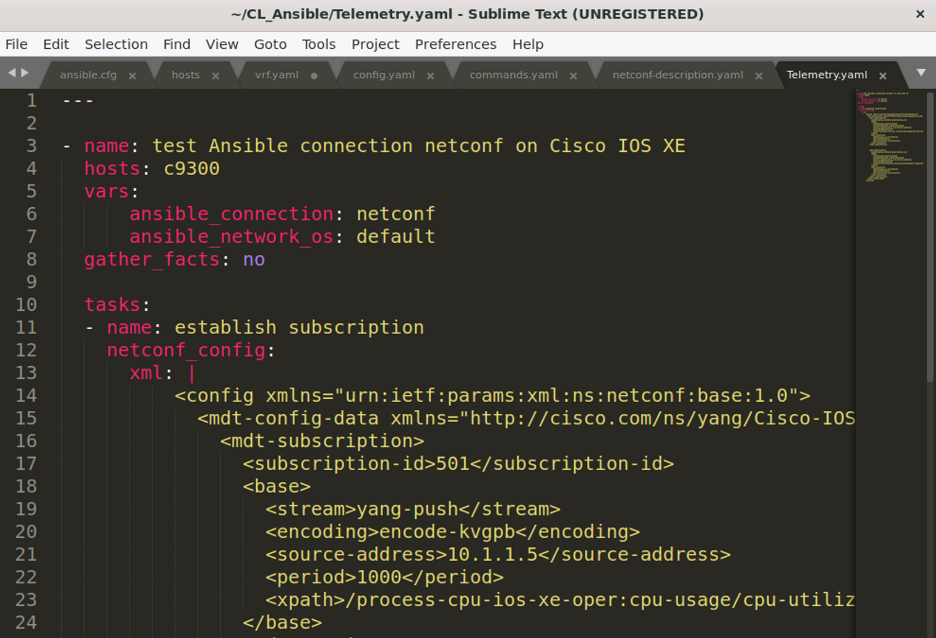

Step 4. Now run the playbook in the Ubuntu Server with the following command and provide the password **Cisco123**:

```
auto@programmability:~/CL_Ansible$ ansible-playbook Telemetry.yaml -u admin -k
SSH password:  Cisco123
```

Connect to c9300 in the Windows desktop and verify interface description on gi1/0/1 have been applied.

You should see the following output:

```
C9300#sh run | sec tele
telemetry ietf subscription 101
 encoding encode-kvgpb
 filter xpath /process-cpu-ios-xe-oper:cpu-usage/cpu-utilization/five-seconds
 stream yang-push
 update-policy periodic 30000
 receiver ip address 10.1.1.3 57500 protocol grpc-tcp
telemetry ietf subscription 201
 encoding encode-kvgpb
 filter xpath /process-cpu-ios-xe-oper:cpu-usage/cpu-utilization/five-seconds
 source-address 10.1.1.5
 stream yang-push
 update-policy periodic 6000
 receiver ip address 10.1.1.3 57501 protocol grpc-tls profile grpc-dial-out-tls
telemetry ietf subscription 501
 encoding encode-kvgpb
 filter xpath /process-cpu-ios-xe-oper:cpu-usage/cpu-utilization/five-seconds
 source-address 10.1.1.5
 stream yang-push
 update-policy periodic 1000
 receiver ip address 10.1.1.3 57500 protocol grpc-tcp
telemetry ietf subscription 502
 encoding encode-kvgpb
 filter xpath /if:interfaces-state/interface[name=\"GigabitEthernet1/0/24\"]/statistics
 source-address 10.1.1.5
 stream yang-push
 update-policy periodic 1000
 receiver ip address 10.1.1.3 57500 protocol grpc-tcp
```

## Conclusion

This module has shown how to start with ansible and create different playbooks for configuring Access lists, VRFs and how to use NETCONF module to configure the switch using XML code. 